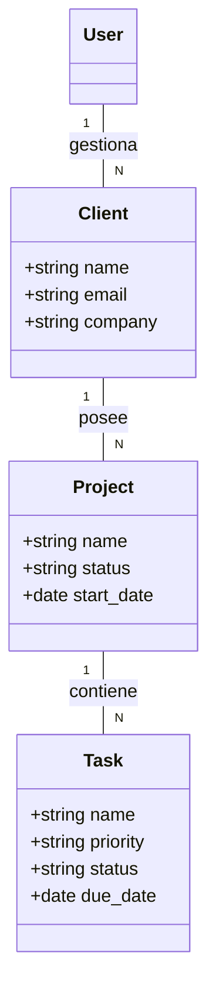

# DOCUMENTACIÓN DEL PROYECTO: RootDev
## FASE 1: ESPECIFICACIÓN DE REQUISITOS DEL PROYECTO

---

### 1. Información General del Proyecto

#### **Título del Proyecto**
**RootDev:** Plataforma SaaS para la Gestión Integral de Freelancers.

#### **Breve Resumen**
RootDev es una aplicación web diseñada para simplificar la administración de trabajadores independientes y pequeñas agencias. Permite centralizar la gestión de clientes (CRM), el seguimiento de proyectos y la organización de tareas en un flujo de trabajo ágil.

#### **Problemática que resuelve**
Muchos freelancers pierden tiempo valioso en tareas administrativas dispersas en hojas de cálculo y correos. RootDev elimina esta fricción centralizando la información de clientes y el progreso de sus proyectos en un solo lugar.

#### **Objetivos del Proyecto**
*   **Centralización:** Proveer un único punto de acceso para la gestión de clientes y sus respectivos proyectos.
*   **Organización:** Facilitar el seguimiento de tareas mediante un sistema de prioridades y estados.
*   **Visibilidad:** Ofrecer un Dashboard con métricas clave sobre la cantidad de clientes y proyectos activos.

---

### 2. Especificación de Requisitos de Software

El proceso de ingeniería de requisitos se dividió en cuatro etapas:

1.  **Captura de Requisitos:** Se identificaron las necesidades básicas de organización que enfrentan los freelancers al manejar múltiples clientes simultáneamente.
2.  **Análisis:** Se priorizaron las funciones esenciales para un Producto Mínimo Viable (MVP), enfocándose en la gestión estructural de la información.
3.  **Especificación:** Se documentaron requisitos funcionales centrados en CRUDs y visualización.
4.  **Validación:** Pruebas de usabilidad sobre el Dashboard y el flujo de creación de tareas.

#### **Diagrama de Casos de Uso**
*   **Actor:** Freelance (Usuario Autenticado).
*   **Casos de Uso Principales:**
    *   Gestionar Clientes (CRUD).
    *   Gestionar Proyectos (CRUD).
    *   Gestionar Tareas (Kanban).
    *   Visualizar Dashboard de Control.

#### **Caso de Uso Extendido: Gestión de Proyectos**
*   **Actor:** Freelance.
*   **Precondición:** El usuario debe estar autenticado y tener al menos un cliente registrado.
*   **Flujo Principal:**
    1. El usuario accede a la sección de "Proyectos".
    2. El sistema muestra la lista de proyectos vinculados a sus clientes.
    3. El usuario selecciona "Crear Proyecto", elige un cliente y asigna un nombre/descripción.
    4. El usuario guarda los cambios.
    5. El sistema permite ahora añadir tareas específicas a ese proyecto.

---

### 3. Arquitectura de Software

**Modelo Elegido:** Arquitectura Hexagonal (Patrón de Puertos y Adaptadores).

**Justificación:**
Se eligió la **Arquitectura Hexagonal** para asegurar una separación clara entre la lógica de negocio (el Core) y los mecanismos de entrada/salida (Frameworks y Herramientas). Esta elección se justifica por los siguientes puntos:

1.  **Independencia de Framework:** El núcleo de la aplicación (la lógica de gestión de estados y relaciones de negocio) es independiente de Django, permitiendo que las reglas de negocio sean estables.
2.  **Múltiples Adaptadores de Entrada:** El sistema permite la interacción tanto a través de una interfaz web dinámica (**Django Templates + HTMX**) como a través de una API programática (**Django REST Framework**).
3.  **Desacoplamiento de Herramientas:** Los adaptadores de salida permiten que la persistencia (PostgreSQL) se maneje como una pieza intercambiable, facilitando el mantenimiento.
4.  **Facilidad de Pruebas:** Al aislar el núcleo, es posible realizar pruebas unitarias sobre la lógica de estados de proyectos sin necesidad de levantar toda la infraestructura de la base de datos.

---

### 4. Plataforma de Trabajo

*   **Sistema Operativo:** Linux (Desarrollo y Despliegue mediante contenedores Docker).
*   **Gestor de Base de Datos:** PostgreSQL 15.
*   **Lenguaje de Programación:** Python 3.11+.
*   **Framework Principal:** Django 4.2 (Backend y ORM).
*   **Herramientas Adicionales:**
    *   **Tailwind CSS:** Para un diseño visual moderno y rápido.
    *   **HTMX:** Para interactividad dinámica sin recargas completas de página.
    *   **WhiteNoise:** Para la gestión eficiente de archivos estáticos.

---

### 5. Metodología de Desarrollo

**Metodología:** **Kanban (Ágil).**

**Justificación:**
Dado que el proyecto es un MVP, Kanban permite un flujo continuo de trabajo. Se prioriza el "Work In Progress" (WIP) limitado para asegurar que cada funcionalidad (como el tablero de tareas) se termine y valide antes de pasar a la siguiente, permitiendo entregas incrementales.

---

### 6. Modelo de Datos

El sistema se basa en un modelo relacional centrado en el Usuario y su capacidad de gestionar múltiples entidades vinculadas.

#### **Objetos de Clase y Relaciones:**

1.  **User (Django Built-in):** Corazón de la autenticación.
2.  **Client:** (N:1 con User). Información de contacto y empresa de los clientes.
3.  **Project:** (N:1 con Client). Agrupador de trabajos.
4.  **Task:** (N:1 with Project). Seguimiento detallado de hitos con prioridades y estados.

#### **Diagrama de Clases (Simplificado):**

