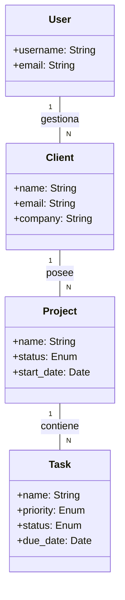
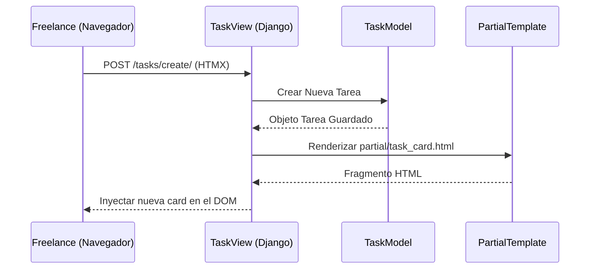
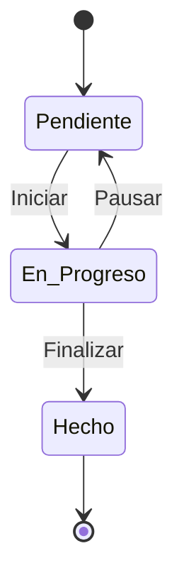
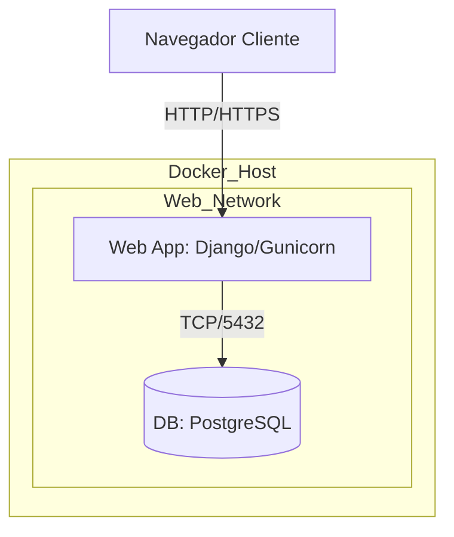

# DOCUMENTACIÓN DEL PROYECTO: FreelanceFlow
## FASE 2: DISEÑO DEL PROYECTO (Metodología SCRUM)

---

### 1. Planificación Ágil (SCRUM)

#### **1.1. Bitácora del Product Backlog**
Priorización de funcionalidades basada en el estado actual del MVP:

| Prioridad | ID   | Requisito / Funcionalidad | Esfuerzo (Puntos) |
|-----------|------|---------------------------|-------------------|
| Alta      | PB01 | Módulo de Autenticación y Perfil de Usuario | 5 |
| Alta      | PB02 | Gestión de Clientes (CRM) | 3 |
| Alta      | PB03 | Gestión de Proyectos (Asociación a Clientes) | 5 |
| Media     | PB04 | Tablero Kanban de Tareas Interactivo (HTMX) | 8 |
| Media     | PB05 | Dashboard de Métricas Operativas | 5 |
| Baja      | PB06 | Integración de IA para Propuestas (Próxima Fase) | 13 |

#### **1.2. Historias de Usuario Detalladas**

*   **HU-01: Registro de Clientes**
    *   **Como:** Freelance.
    *   **Quiero:** Registrar mis clientes con su información de contacto y empresa.
    *   **Para:** Eliminar el uso de hojas de cálculo externas.
    *   **Criterios de Aceptación:**
        *   Cada cliente debe estar vinculado al usuario autenticado.
        *   Se debe poder editar y eliminar la información.

*   **HU-04: Gestión de Tareas Kanban**
    *   **Como:** Freelance.
    *   **Quiero:** Mover tareas entre estados (Pendiente, En Progreso, Hecho).
    *   **Para:** Visualizar mi flujo de trabajo diario de forma gráfica.
    *   **Criterios de Aceptación:**
        *   Los cambios de estado deben realizarse mediante HTMX (sin recargar página).
        *   Cada tarea debe pertenecer a un proyecto específico.

#### **1.3. Planificación de Sprints**

*   **Sprint 1: Cimientos y CRM (Finalizado)**
    *   *Objetivo:* Setup del proyecto y gestión de clientes.
    *   *Logros:* Modelos de User/Client, CRUD de clientes con templates Tailwind.
*   **Sprint 2: Gestión de Trabajo y Kanban (En Progreso)**
    *   *Objetivo:* Implementar proyectos y el tablero visual.
    *   *Tareas:* Modelo Project, Modelo Task, Interfaz Kanban con HTMX.
*   **Sprint 3: Dashboard y Refinamiento (Próximo)**
    *   *Objetivo:* Centralizar métricas y mejorar la UX.
    *   *Tareas:* Vista de Dashboard, optimización de queries, preparación para Fase 3.

---

### 2. Diseño UML del Sistema

#### **2.1. Diagrama de Clases y Objetos**



#### **2.2. Diagrama de Secuencia (Creación de Tarea vía HTMX)**



#### **2.3. Diagrama de Colaboración**
1. **Freelance** -> interactúa con el Tablero Kanban.
2. `KanbanView` -> solicita tareas al `ProjectManager`.
3. `ProjectManager` -> filtra tareas por Usuario/Proyecto.
4. `TaskCard` -> permite el cambio de estado mediante drag-and-drop o botones HTMX.

#### **2.4. Diagrama de Estados (Tarea)**



#### **2.5. Diagrama de Componentes**

```mermaid
component {
    [UI - Tailwind/HTMX] as Frontend
    [Core Business Logic] as Core
    [Django ORM] as DataLayer
    [PostgreSQL] as Database
}
Frontend --> Core
Core --> DataLayer
DataLayer --> Database
```

#### **2.6. Diagrama de Despliegue**


