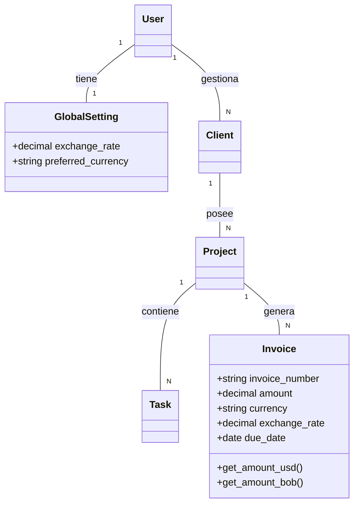

# DOCUMENTACIÓN DEL PROYECTO: FreelanceFlow
## FASE 1: ESPECIFICACIÓN DE REQUISITOS DEL PROYECTO

---

### 1. Información General del Proyecto

#### **Título del Proyecto**
**FreelanceFlow:** Plataforma SaaS para la Gestión Integral de Freelancers.

#### **Breve Resumen**
FreelanceFlow es una aplicación web diseñada para simplificar la administración de trabajadores independientes y pequeñas agencias. Permite centralizar la gestión de clientes (CRM), el seguimiento de proyectos y tareas, y un sistema automatizado de facturación.

#### **Problemática que resuelve**
Muchos freelancers pierden tiempo valioso en tareas administrativas dispersas en hojas de cálculo y correos. FreelanceFlow elimina esta fricción automatizando los cálculos y centralizando la información.

#### **Objetivos del Proyecto**
*   **Centralización:** Proveer un único punto de acceso para la gestión de clientes, proyectos y cobros.
*   **Profesionalización:** Facilitar la generación de facturas en PDF profesionales y listas para enviar.
*   **Visibilidad:** Ofrecer un Dashboard con métricas clave (ingresos pendientes, proyectos activos) en la moneda preferida del usuario.

---

### 2. Especificación de Requisitos de Software

El proceso de ingeniería de requisitos se dividió en cuatro etapas:

1.  **Captura de Requisitos:** Se realizaron entrevistas con freelancers reales para identificar cuellos de botella en su facturación y seguimiento de tareas.
2.  **Análisis:** Se priorizaron las funciones esenciales para un Producto Mínimo Viable (MVP), descartando inicialmente funciones complejas como pasarelas de pago externas.
3.  **Especificación:** Se documentaron requisitos funcionales.
4.  **Validación:** Pruebas de usabilidad sobre el Dashboard y el flujo de creación de facturas.

#### **Diagrama de Casos de Uso**
*   **Actor:** Freelance (Usuario Autenticado).
*   **Casos de Uso Principales:**
    *   Gestionar Clientes (CRUD).
    *   Gestionar Proyectos y Tareas.
    *   Emitir Facturas.
    *   Configurar Ajustes Globales.

#### **Caso de Uso Extendido: Configuración de Tipo de Cambio**
*   **Actor:** Freelance.
*   **Precondición:** El usuario debe estar autenticado.
*   **Flujo Principal:**
    1. El usuario accede al panel de "Ajustes".
    2. El sistema muestra el T.C. actual y la moneda preferida.
    3. El usuario ingresa un nuevo valor para el T.C. (1 USD = X Bs).
    4. El usuario guarda los cambios.
    5. El sistema actualiza el Dashboard y las nuevas facturas reflejan este cambio.

---

### 3. Arquitectura de Software

**Modelo Elegido:** Arquitectura Hexagonal (Patrón de Puertos y Adaptadores).

**Justificación:**
Se eligió la **Arquitectura Hexagonal** para asegurar una separación clara entre la lógica de negocio (el Core) y los mecanismos de entrada/salida (Frameworks y Herramientas). Esta elección se justifica por los siguientes puntos:

1.  **Independencia de Framework:** El núcleo de la aplicación (la lógica de conversión de moneda y gestión de proyectos) no depende directamente de Django, permitiendo que las reglas de negocio sean estables frente a cambios tecnológicos.
2.  **Múltiples Adaptadores de Entrada:** El sistema permite la interacción tanto a través de una interfaz web dinámica (**Django Templates + HTMX**) como a través de una API programática (**Django REST Framework**).
3.  **Desacoplamiento de Herramientas:** Los adaptadores de salida permiten que la persistencia (PostgreSQL) y la generación de documentos (WeasyPrint) se manejen como piezas intercambiables, facilitando el mantenimiento y la escalabilidad del SaaS.
4.  **Facilidad de Pruebas:** Al aislar el núcleo, es posible realizar pruebas unitarias exhaustivas sobre la lógica financiera (Dólares vs. Bolivianos) sin necesidad de levantar toda la infraestructura de la base de datos o el servidor web.

---

### 4. Plataforma de Trabajo

*   **Sistema Operativo:** Linux (Desarrollo y Despliegue mediante contenedores Docker).
*   **Gestor de Base de Datos:** PostgreSQL 15 (Elegido por su robustez y manejo nativo de tipos decimales para finanzas).
*   **Lenguaje de Programación:** Python 3.11+.
*   **Framework Principal:** Django 4.2 (Backend y ORM).
*   **Herramientas Adicionales:**
    *   **Tailwind CSS:** Para un diseño visual moderno y rápido.
    *   **WeasyPrint:** Para la generación de reportes PDF.
    *   **WhiteNoise:** Para la gestión eficiente de archivos estáticos.

---

### 5. Metodología de Desarrollo

**Metodología:** **Kanban (Ágil).**

**Justificación:**
Dado que el proyecto es un MVP con requisitos que evolucionan rápidamente , Kanban permite un flujo continuo de trabajo. Se prioriza el "Work In Progress" (WIP) limitado para asegurar que cada funcionalidad (como el sistema de moneda) se termine y valide antes de pasar a la siguiente, permitiendo entregas incrementales y ajustes inmediatos basados en el feedback.

---

### 6. Modelo de Datos

El sistema se basa en un modelo relacional centrado en el Usuario y su capacidad de gestionar múltiples entidades vinculadas.

#### **Objetos de Clase y Relaciones:**

1.  **User (Django Built-in):** Corazón de la autenticación.
2.  **GlobalSetting:** (1:1 con User). Almacena el `exchange_rate` y la `preferred_currency`.
3.  **Client:** (N:1 con User). Información de contacto de los clientes.
4.  **Project:** (N:1 con Client). Agrupador de trabajos y facturas.
5.  **Task:** (N:1 con Project). Seguimiento detallado de hitos.
6.  **Invoice:** (N:1 con Project). Registro financiero que guarda el `exchange_rate` histórico para auditoría.

#### **Diagrama de Clases (Simplificado):**

