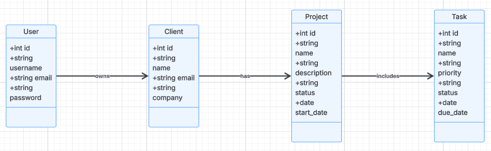
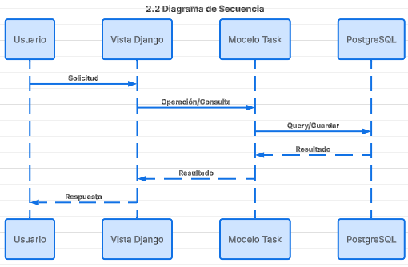
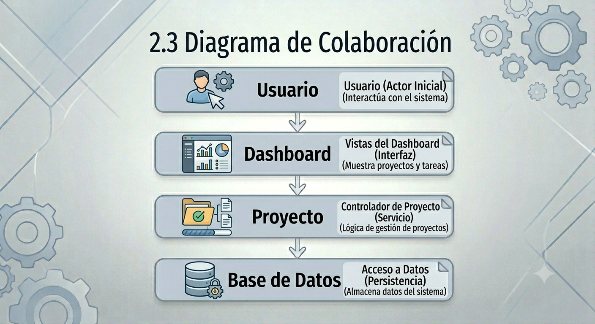

# RootDev
### Plataforma SaaS para la Gestión Integral de Freelancers

**INS - 600 INGENIERIA DE SOFTWARE**

  Estudiante: Armin Daniel Antonio Mendieta 
  Catedrático: Pablo Osco

  
    Presiona Espacio para continuar <carbon:arrow-right class="inline"/>
  

---
layout: center
class: text-center
---

# Resumen del Proyecto 📝

**RootDev** es una aplicación web diseñada para facilitar la administración de clientes, proyectos y tareas de trabajadores independientes y pequeñas agencias.

Centraliza toda la información, permitiendo un mejor seguimiento de actividades, control de tiempos y organización del trabajo mediante herramientas modernas como tableros **Kanban** y **Dashboards** interactivos.

---

# Problemática y Objetivos 🎯

### La Problemática
* ❌ Pérdida de información por uso de herramientas dispersas (Excel, correos).
* ❌ Falta de seguimiento de proyectos y priorización de tareas.
* ❌ Baja eficiencia operativa y dificultad para medir productividad.

### Objetivo General
Desarrollar una plataforma web para la gestión integral de clientes, proyectos y tareas orientada a freelancers.

### Objetivos Específicos
* ✅ Centralizar la gestión de clientes.
* ✅ Organizar proyectos asociados a clientes.
* ✅ Gestionar tareas mediante Kanban.
* ✅ Visualizar métricas y exponer servicios **REST**.

---

# Requisitos del Sistema (MVP) 📋

  

    <h3 class="text-primary font-bold">Funcionales (RF)</h3>
    <ul class="text-xs list-disc pl-4">
      <li>Registro y Autenticación de usuarios.</li>
      <li>CRUD completo de Clientes.</li>
      <li>Gestión de Proyectos vinculados a clientes.</li>
      <li>Gestión de Tareas con estados dinámicos.</li>
      <li>Dashboard de indicadores de productividad.</li>
      <li>Exposición de servicios vía <b>API REST</b>.</li>
    </ul>
  

  

    <h3 class="text-primary font-bold">No Funcionales (RNF)</h3>
    <ul class="text-xs list-disc pl-4">
      <li>Disponibilidad > 95%.</li>
      <li>Interfaz amigable e intuitiva.</li>
      <li>Seguridad robusta mediante autenticación.</li>
      <li>Persistencia con <b>PostgreSQL</b>.</li>
      <li>Arquitectura desacoplada y escalable.</li>
    </ul>
  

---

# Arquitectura: Hexagonal (Puertos y Adaptadores) 🏗️

Elegida para separar la lógica de negocio de los detalles técnicos.

*   **Independencia:** El núcleo es independiente del framework Django.
*   **Testabilidad:** Facilita las pruebas unitarias del dominio.
*   **Mantenibilidad:** Código más limpio y fácil de evolucionar.
*   **Flexibilidad:** Permite cambiar adaptadores (DB, UI, APIs) con mínimo impacto.

---

# Plataforma de Trabajo 🛠️

| Componente | Tecnología |
|---|---|
| **S.O.** | Fedora Linux |
| **Lenguaje** | Python 3.14.5 |
| **Backend** | Django 4.2.30 |
| **API REST** | Django REST Framework 3.17.1 |
| **Base de Datos** | PostgreSQL + Django ORM |
| **Interactividad** | HTMX |
| **Estilos** | Tailwind CSS |
| **Otros** | WhiteNoise, Dotenv, WeasyPrint |

---
background: https://images.unsplash.com/photo-1531403009284-440f080d1e12?auto=format&fit=crop&q=80&w=1920
---

# Metodología: SCRUM Ágil 🔄

Desarrollo iterativo e incremental organizado en fases:

  <table class="w-full text-left border-collapse bg-white dark:bg-gray-900">
    <thead class="bg-primary text-white">
      <tr>
        <th class="px-4 py-3 font-bold uppercase text-xs tracking-wider">Sprint</th>
        <th class="px-4 py-3 font-bold uppercase text-xs tracking-wider">Objetivo Principal</th>
        <th class="px-4 py-3 font-bold uppercase text-xs tracking-wider">Entregables Clave</th>
      </tr>
    </thead>
    <tbody class="divide-y divide-gray-200 dark:divide-gray-800 text-sm">
      <tr class="hover:bg-primary/5 transition-colors">
        <td class="px-4 py-4 font-bold text-primary">Sprint 1</td>
        <td class="px-4 py-4 italic">Cimientos y Seguridad</td>
        <td class="px-4 py-4 text-xs">Configuración Base, PostgreSQL, Auth de Usuarios y CRUD de Clientes.</td>
      </tr>
      <tr class="hover:bg-primary/5 transition-colors">
        <td class="px-4 py-4 font-bold text-primary">Sprint 2</td>
        <td class="px-4 py-4 italic">Operación Core</td>
        <td class="px-4 py-4 text-xs">Gestión de Proyectos, Tareas y Tablero Kanban interactivo con HTMX.</td>
      </tr>
      <tr class="hover:bg-primary/5 transition-colors">
        <td class="px-4 py-4 font-bold text-primary">Sprint 3</td>
        <td class="px-4 py-4 italic">Métricas y Conectividad</td>
        <td class="px-4 py-4 text-xs">Dashboard de Productividad y exposición de la API REST.</td>
      </tr>
    </tbody>
  </table>

---

# Diagrama de Casos de Uso 👤

  

    
Representación de las interacciones entre el <b>Freelancer</b> y las funcionalidades core del sistema.

    

      <h4 class="font-bold text-primary">Puntos Clave:</h4>
      <ul class="list-disc pl-5 text-sm">
        <li>Gestión de Clientes (CRUD)</li>
        <li>Administración de Proyectos</li>
        <li>Control de Tareas y Kanban</li>
        <li>Visualización de Métricas</li>
      </ul>
    

  

  

    

    

      
    

  

---

# Diagrama de Clases 📊

  
Estructura detallada de las entidades y la jerarquía de datos en <b>RootDev</b>.

  
  

     

       

       

       

     

     

        
        
Relación: User ➔ Client ➔ Project ➔ Task

     

  

---

# Diagramas de Comportamiento ⚙️

  

    <h3 class="flex items-center gap-2 text-primary mb-2 font-bold"><carbon:flow-data /> Secuencia</h3>
    

      
    

  

  

    <h3 class="flex items-center gap-2 text-primary mb-2 font-bold"><carbon:connect-recursive /> Colaboración</h3>
    

      
    

  

---

# Diagrama de Estados 🔄

  
Control del ciclo de vida de una <b>Tarea</b>, garantizando la consistencia del flujo de trabajo.

  
  

    
  

---

# Módulo: CRM y Gestión de Clientes 👥

Centralización de la información de contacto y empresarial.

  

    <ul>
      <li><b>CRUD Completo:</b> Registro, edición y eliminación de clientes.</li>
      <li><b>Seguridad:</b> Cada cliente está vinculado estrictamente al usuario autenticado.</li>
      <li><b>Interfaz:</b> Tablas dinámicas con Tailwind CSS y HTMX para búsquedas rápidas.</li>
    </ul>
    

      <ZoomImg src="./images/login_register.png" class="w-full h-32 object-cover rounded" />
      
Interfaz de Acceso Seguro

    

  

  

    <ZoomImg src="./images/clientes.png" class="rounded shadow-lg border border-gray-200" />
  

---

# Módulo: Proyectos y Tablero Kanban 📋

El corazón operativo de RootDev.

  

    

      <h3 class="font-bold text-sm">Gestión de Proyectos</h3>
      
Asociación jerárquica que permite organizar el trabajo por cliente.

      <ZoomImg src="./images/proyectos.png" class="mt-2 rounded shadow-sm border border-gray-200" />
    

    
  
  

  

    <ZoomImg src="./images/tareas.png" class="rounded shadow-lg border border-gray-200" />
  

---

# Módulo: Dashboard de Productividad 📊

Visualización de métricas en tiempo real para la toma de decisiones.

  

    
ClientesTotal Registrados

    
ProyectosEn Ejecución

    
TareasPendientes/Hechas

  

  

    <ZoomImg src="./images/dashboard.png" class="max-h-full object-contain rounded" />
  

---

# Plan de Pruebas Detallado 🛡️

Estrategia de validación en múltiples niveles.

1.  **Pruebas Unitarias:** Validación de lógica en modelos y formularios (Cobertura total en lógica core).
2.  **Pruebas de Integración:** Verificación del flujo de datos entre ORM y Vistas.
3.  **Pruebas Funcionales:** Simulación de navegación del usuario (Login -> Registro -> Dashboard).
4.  **Pruebas de Seguridad:** Validación de redirecciones y acceso restringido.

  $ python manage.py test freelance_core 
  Creating test database for alias 'default'... 
  System check identified no issues (0 silenced). 
  ....... 
  ---------------------------------------------------------------------- 
  Ran 7 tests in 6.759s  
  OK 
  Destroying test database for alias 'default'...

---

# Evidencias de Validación ✅

  

    <table class="w-full">
      <thead>
        <tr class="border-b border-primary/30">
          <th class="text-left py-2">Caso de Prueba</th>
          <th class="text-left py-2">Estado</th>
        </tr>
      </thead>
      <tbody class="divide-y divide-gray-200 dark:divide-gray-700">
        <tr><td class="py-2">Registro de Usuarios</td><td class="py-2 text-green-500 font-bold">EXITOSO</td></tr>
        <tr><td class="py-2">Autenticación (Login)</td><td class="py-2 text-green-500 font-bold">EXITOSO</td></tr>
        <tr><td class="py-2">Protección de Rutas (Middleware)</td><td class="py-2 text-green-500 font-bold">EXITOSO</td></tr>
        <tr><td class="py-2">Gestión de Clientes y Proyectos</td><td class="py-2 text-green-500 font-bold">EXITOSO</td></tr>
        <tr><td class="py-2">Integridad Referencial (Cascada)</td><td class="py-2 text-green-500 font-bold">EXITOSO</td></tr>
      </tbody>
    </table>
    

      
Resultado Final:

      
100% de las pruebas críticas superadas en entorno PostgreSQL.

    

  

  

    
Endpoints API REST

    

      <ZoomImg src="./images/APIREST.png" class="h-full object-contain" />
    

  

---

# Conclusiones y Futuro 🎓

### Conclusiones
* ✅ Se desarrolló una herramienta integral, robusta y escalable.
* ✅ La arquitectura hexagonal permite una evolución técnica sin deuda técnica masiva.
* ✅ HTMX reduce la complejidad del frontend manteniendo una experiencia de alta calidad.

### Próximos Pasos (Fase 3+)
* 🤖 **IA Engine:** Predicción de tiempos basada en histórico de tareas.
* 📱 **Mobile Native:** App en Flutter para gestión on-the-go.
* 📈 **Analytics:** Reportes avanzados de rentabilidad por cliente.

---
layout: center
class: text-center
background: https://images.unsplash.com/photo-1522202176988-66273c2fd55f?auto=format&fit=crop&q=80&w=1920
---

# ¡Gracias por su atención!

**RootDev**
*Carrera de Informática Industrial - I.T.E.I.S. "Pedro Domingo Murillo"*

  Estudiante: Armin Daniel Antonio Mendieta

