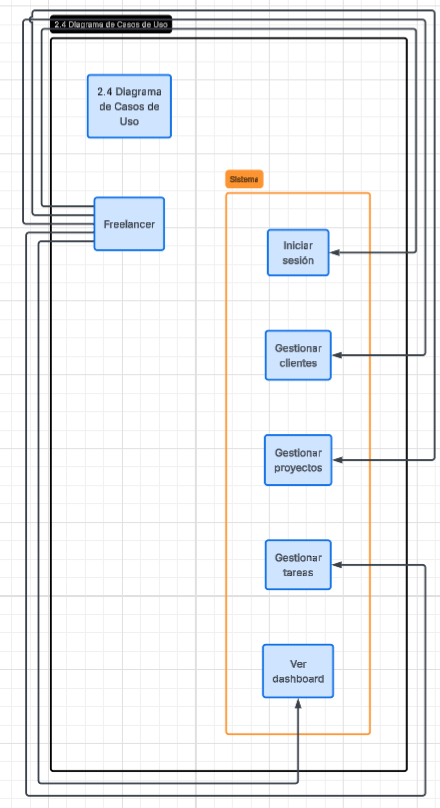
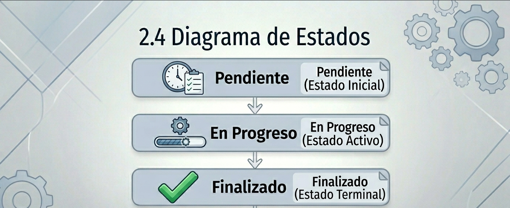

# RootDev
### Plataforma para la Gestión Integral de Freelancers

**INS - 600 INGENIERIA DE SOFTWARE**

  Estudiante: Armin Daniel Antonio Mendieta 

  
    Presiona Espacio para continuar <carbon:arrow-right class="inline"/>
  

<!-- 
TIEMPO: 0:30
- Presentarse.
- Mencionar el nombre del proyecto: RootDev.
- Indicar que es para la materia INS-600.
-->

---
layout: center
class: text-center
---

# Resumen del Proyecto 📝

**RootDev** es una aplicación web diseñada para facilitar la administración de clientes, proyectos y tareas de trabajadores independientes y pequeñas agencias.

Centraliza toda la información, permitiendo un mejor seguimiento de actividades, control de tiempos y organización del trabajo mediante herramientas modernas como tableros **Kanban** y **Dashboards** interactivos.

<!-- 
TIEMPO: 0:30
- Definir RootDev: Una solución SaaS para freelancers.
- Objetivo principal: Centralización y optimización del flujo de trabajo.
-->

---

# Problemática y Objetivos 🎯

### La Problemática
* ❌ Pérdida de información por uso de herramientas dispersas.
* ❌ Falta de seguimiento de proyectos.

### Objetivo General
Desarrollar una plataforma web para la gestión integral de clientes, proyectos y tareas orientada a freelancers.

### Objetivos Específicos
* ✅ Centralizar la gestión de clientes.
* ✅ Organizar proyectos asociados.
* ✅ Visualizar métricas y exponer servicios **REST**.

<!-- 
TIEMPO: 0:45
- Explicar el dolor del usuario: El desorden de usar Excel o correos.
- Mencionar que RootDev ataca directamente esa ineficiencia.
-->

---

# Requisitos del Sistema (MVP) 📋

  

    <h3 class="text-primary font-bold">Funcionales (RF)</h3>
    <ul class="text-xs list-disc pl-4">
      <li>Registro y Autenticación.</li>
      <li>CRUD de Clientes y Proyectos.</li>
      <li>Gestión de Tareas (Kanban).</li>
      <li>Exposición de <b>API REST</b>.</li>
    </ul>
  

  

    <h3 class="text-primary font-bold">No Funcionales (RNF)</h3>
    <ul class="text-xs list-disc pl-4">
      <li>Seguridad mediante autenticación.</li>
      <li>Persistencia con <b>PostgreSQL</b>.</li>
      <li>Interfaz intuitiva con Tailwind.</li>
    </ul>
  

<!-- 
TIEMPO: 0:30
- No leer todo, solo resaltar: Autenticación, Kanban y API REST.
- Mencionar que se buscó seguridad y persistencia sólida.
-->

---

# Arquitectura: Hexagonal 🏗️

Elegida para separar la lógica de negocio de los detalles técnicos.

*   **Independencia:** El núcleo es independiente del framework Django.
*   **Testabilidad:** Facilita las pruebas unitarias del dominio.
*   **Mantenibilidad:** Código más limpio y fácil de evolucionar.
*   **Flexibilidad:** Permite cambiar adaptadores (DB, UI) con mínimo impacto.

<!-- 
TIEMPO: 0:50
- EXPLICAR BIEN: Es el pilar técnico. 
- La lógica de negocio está protegida de cambios externos.
- Facilita los tests que veremos más adelante.
-->

---

# Plataforma de Trabajo 🛠️

| Componente | Tecnología |
|---|---|
| **S.O.** | Fedora Linux |
| **Lenguaje** | Python 3.14.5 |
| **Backend** | Django 4.2.30 |
| **API REST** | Django REST Framework 3.17.1 |
| **Base de Datos** | PostgreSQL + Django ORM |
| **Interactividad** | HTMX + Tailwind CSS |

<!-- 
TIEMPO: 0:20
- Rápido: Usamos Python/Django por su robustez y PostgreSQL para datos críticos.
- HTMX para no sobrecargar el frontend.
-->

---
background: https://images.unsplash.com/photo-1531403009284-440f080d1e12?auto=format&fit=crop&q=80&w=1920
---

# Metodología: SCRUM Ágil 🔄

Desarrollo iterativo e incremental organizado en fases:

  <table class="w-full text-left border-collapse bg-white dark:bg-gray-900">
    <thead class="bg-primary text-white">
      <tr>
        <th class="px-4 py-3 font-bold uppercase text-xs tracking-wider">Sprint</th>
        <th class="px-4 py-3 font-bold uppercase text-xs tracking-wider">Objetivo</th>
        <th class="px-4 py-3 font-bold uppercase text-xs tracking-wider">Entregables</th>
      </tr>
    </thead>
    <tbody class="divide-y divide-gray-200 dark:divide-gray-800 text-sm">
      <tr>
        <td class="px-4 py-4 font-bold text-primary">Sprint 1</td>
        <td class="px-4 py-4 italic">Seguridad</td>
        <td class="px-4 py-4 text-xs">Auth y Clientes.</td>
      </tr>
      <tr>
        <td class="px-4 py-4 font-bold text-primary">Sprint 2</td>
        <td class="px-4 py-4 italic">Operación</td>
        <td class="px-4 py-4 text-xs">Kanban y Proyectos.</td>
      </tr>
      <tr>
        <td class="px-4 py-4 font-bold text-primary">Sprint 3</td>
        <td class="px-4 py-4 italic">Métricas</td>
        <td class="px-4 py-4 text-xs">Dashboard y API REST.</td>
      </tr>
    </tbody>
  </table>

<!-- 
TIEMPO: 0:30
- Dividido en 3 etapas claras: Desde la base segura hasta el análisis de datos.
-->

---

# Diagrama de Casos de Uso 👤

  

    
Interacciones principales: Gestión de Clientes, Proyectos y Métricas.

  

  

    
  

<!-- 
TIEMPO: 0:30
- El actor principal es el Freelancer.
- Resaltar las 3 áreas de acción: Administrativa, Operativa y Analítica.
-->

---

# Diagrama de Clases 📊

  

     

        
        
User ➔ Client ➔ Project ➔ Task

     

  

<!-- 
TIEMPO: 0:40
- Explicar la jerarquía: Un usuario tiene N clientes, un cliente tiene N proyectos...
- Es una estructura relacional sólida.
-->

---

# Diagramas de Comportamiento ⚙️

  

    <h3 class="flex items-center gap-2 text-primary font-bold">Secuencia</h3>
    

      
    

  

  

    <h3 class="flex items-center gap-2 text-primary font-bold">Colaboración</h3>
    

      
    

  

<!-- 
TIEMPO: 0:40
- Secuencia: Cómo viajan los mensajes para crear una tarea.
- Colaboración: Cómo se organizan los objetos estructuralmente.
-->

---

# Diagrama de Estados 🔄

  

    
  

<!-- 
TIEMPO: 0:30
- Ciclo de vida de una tarea: De Pendiente a Completada.
- Es vital para el funcionamiento del Kanban.
-->

---

# Módulo: CRM y Gestión de Clientes 👥

  

    <ul class="text-sm">
      <li><b>CRUD Completo</b> de Clientes.</li>
      <li><b>Seguridad:</b> Datos aislados por usuario.</li>
    </ul>
    

      <ZoomImg src="./images/login_register.png" class="w-full h-32 object-cover rounded" />
    

  

  

    <ZoomImg src="./images/clientes.png" class="rounded shadow-lg" />
  

<!-- 
TIEMPO: 0:40
- ENTRAR EN DETALLE: Aquí empieza el zoom.
- Mostrar la interfaz limpia y el acceso seguro.
-->

---

# Módulo: Proyectos y Tablero Kanban 📋

  

    

      <h3 class="font-bold text-sm text-primary">Gestión de Proyectos</h3>
      <ZoomImg src="./images/proyectos.png" class="mt-2 rounded shadow-sm" />
    

  

  

    <ZoomImg src="./images/tareas.png" class="rounded shadow-lg" />
  

<!-- 
TIEMPO: 0:50
- EL CORAZÓN: Explica cómo el Kanban usa HTMX para actualizaciones sin recarga.
- Haz zoom en las tareas para que vean el detalle.
-->

---

# Módulo: Dashboard de Productividad 📊

  

    <ZoomImg src="./images/dashboard.png" class="max-h-full object-contain rounded" />
  

<!-- 
TIEMPO: 0:40
- El valor agregado: El freelancer ve cuánto está produciendo en tiempo real.
-->

---

# Plan de Pruebas Automatizado 🛡️

Puntos validados en el módulo `freelance_core`:

1.  **Creación de Entidades:** Registro correcto de Clientes, Proyectos y Tareas.
2.  **Borrado en Cascada:** Validación de la integridad referencial en la base de datos.
3.  **Protección de Rutas:** Verificación de redirección al Login para usuarios no autorizados.
4.  **Gestión de Cuentas:** Validación de los flujos de Registro e Inicio de Sesión.

  $ python manage.py test freelance_core 
  Creating test database for alias 'default'... 
  ....... 
  Ran 7 tests in 6.759s | Result: OK

<!-- 
TIEMPO: 0:30
- Menciona que las pruebas son automatizadas y corren sobre PostgreSQL.
- Cubren desde la creación de usuarios hasta el borrado en cascada.
-->

---

# Evidencias de Validación ✅

  

    <table class="w-full">
      <tbody class="divide-y">
        <tr><td class="py-2">Auth y Registro</td><td class="py-2 text-green-600 font-bold">EXITOSO</td></tr>
        <tr><td class="py-2">Middleware de Seguridad</td><td class="py-2 text-green-600 font-bold">EXITOSO</td></tr>
        <tr><td class="py-2">Integridad de Datos</td><td class="py-2 text-green-600 font-bold">EXITOSO</td></tr>
      </tbody>
    </table>
  

  

    

      <ZoomImg src="./images/APIREST.png" class="h-full object-contain" />
    

  

<!-- 
TIEMPO: 0:30
- Resumen final de validación. 
- Mencionar la API REST como evidencia de conectividad.
-->

---

# Conclusiones y Futuro 🎓

### Conclusiones (Cumplimiento de Objetivos)
* ✅ **Gestión Centralizada:** Se logró unificar la información de clientes en un entorno seguro y accesible.
* ✅ **Organización Operativa:** La estructura de proyectos y el tablero Kanban optimizan el seguimiento de tareas.
* ✅ **Analítica y Conectividad:** El Dashboard y la API REST permiten la toma de decisiones basada en datos.

### Futuro
* 🤖 Predicción con IA.
* 📱 App Móvil.

<!-- 
TIEMPO: 0:30
- El proyecto cumple todos los objetivos.
- RootDev está listo para evolucionar.
-->

---
layout: center
class: text-center
background: https://images.unsplash.com/photo-1522202176988-66273c2fd55f?auto=format&fit=crop&q=80&w=1920
---

# ¡Gracias por su atención!

**RootDev**

  Estudiante: Armin Daniel Antonio Mendieta

<!-- 
TIEMPO: 0:05
- Cierre y preguntas.
-->

